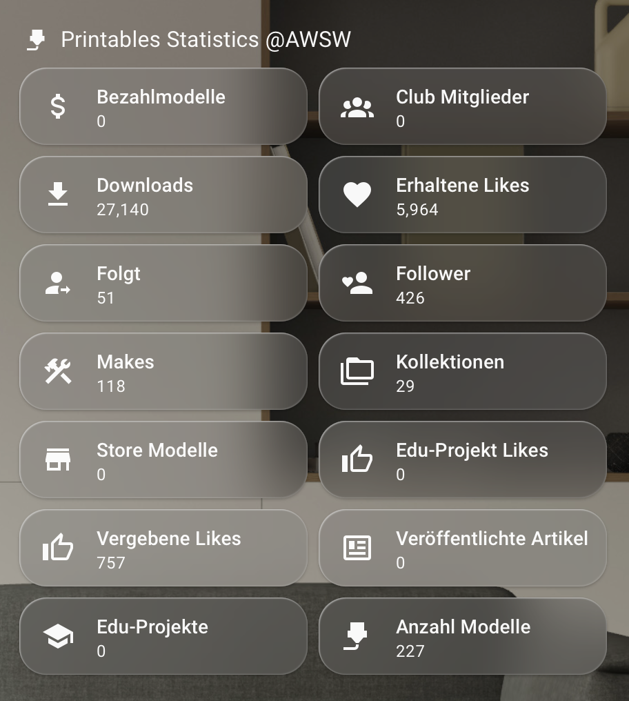

# Printables Stats for Home Assistant

HACS integration for the Prusa Printables user AWSW. =)

You can find my profile and my models here: https://www.printables.com/@AWSW/models

Custom integration for Home Assistant that exposes public statistics from a Printables.com user profile as sensors.

> The originally requested `Prointables.com` domain does not appear to expose a public site. This integration targets `Printables.com` and keeps the website/API base URLs configurable.

## Sensors

- Downloads
- Followers and following
- Published models, paid models, store models
- Published edu projects and articles
- Likes given and likes received
- Makes
- Collections
- Club members
- Profile level

## Installation with HACS

1. Add this repository as a custom HACS repository.
2. Select category `Integration`.
3. Install `Printables Stats`.
4. Restart Home Assistant.
5. Add the integration from **Settings > Devices & services > Add integration**.

## Configuration

Enter a Printables profile handle like `AWSW`, `@AWSW`, or a profile URL like `https://www.printables.com/@AWSW`.

The integration resolves the handle through `https://api.printables.com/graphql/`, then polls public profile statistics every 30 minutes. No login or token is required.

## Icons

HACS uses `brand/icon.png` from the repository root for the store listing. Home Assistant 2026.3 and newer use `custom_components/printables_stats/brand/icon.png` and `logo.png` for the installed integration.

## Notes

Printables does not publish this API as a stable third-party contract. The integration includes a fallback parser for the public profile page, but future site changes can still require updates.
